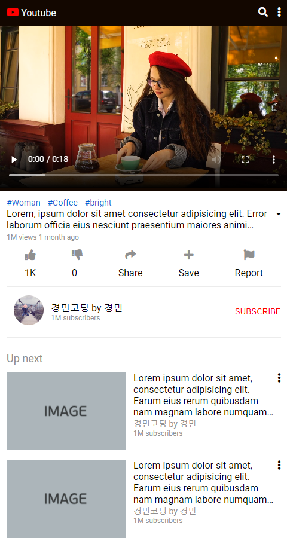

# 유튜브 클론코딩 (Youtube CloneCoding)

## 강의 자료

[[클론코딩 유튜브 사이트 따라 만들기(HTML+CSS 연습편, 웹 포트폴리오)]](https://www.youtube.com/watch?v=67stn7Pu7s4&list=PLv2d7VI9OotQ1F92Jp9Ce7ovHEsuRQB3Y&index=15)

## 강의를 볼 때 주의사항

1. 강의를 보면서 따라만들면 내 것이 안된다.

2. 강의를 보기 전에 화면만 보고 한번 만들어보고 잘 안되면 강의를 먼저 보고난 후에 강의를 생각하며 만든다.

3. 부족한 부분 있다면 다시 강의를 보고난 후 생각하며 다시 처음부터 만든다.

4. 강의를 많이 보는 것보다 중요한 것은 하나를 보더라도 내 것이 되는가이다.

## 결과물

### [ Small ]

### [ Large ]

## 코딩 순서 및 문제

### 1. 화면만 보고 코딩(제한시간 : 1시간)

    - 아이콘을 찾는데 시간을 많이 소모하였다.
        > 미리 찾아두자.
    - 웹페이지를 박스로 보는데 시간이 오래걸렸다.
        > 연습 부족
    - 시간 부족으로 html문서 밖에 만들지 못했다.
        > 연습 부족

### 2. 화면과 힌트 보고 코딩(제한시간 : 2시간)

    [문제]
    - 모바일 버전에서 스크롤 시, 비디오플레이어의 위치 고정하면 비디오를 설명하는 박스가 가려져 안보인다.

    - font 적용 X

    - 시간 부족하여 반응형 웹으로 만들지 못했다.

    - 시간 부족으로 js를 적용하지 못했다.

### 3. 강의 영상 끝까지 보고 난 후 코딩(제한시간 : 2시간) -> 30분 초과(반성할 것)

    [해결]
    - 모바일 버전에서 스크롤 시, 비디오플레이어의 위치 고정하면 비디오를 설명하는 박스가 가려져 안보인다.
        > position: sticky;
          top: 0;
          을 이용하여 해결.

    - font 적용 X
        > font-family: "Roboto"; 적용

    - 시간 부족하여 반응형 웹으로 만들지 못했다.
        > 해상도가 일정 이상 커질 경우 재생 목록이 오른쪽으로 이동한다.

    - 시간 부족으로 js를 적용하지 못했다.
        > 이번에도 적용하지 못했다.

    [문제]
    - 시간 부족으로 js를 적용하지 못했다.

    - morebtn에 애니메이션을 적용하지 못했다.

    - 좋아요 액션버튼을 파란색으로 바꾸지 못했다.

### 4. 강의 영상을 다시 한번 보고 난 후 코딩(제한시간 : 2시간)

    - 진행 예정.
